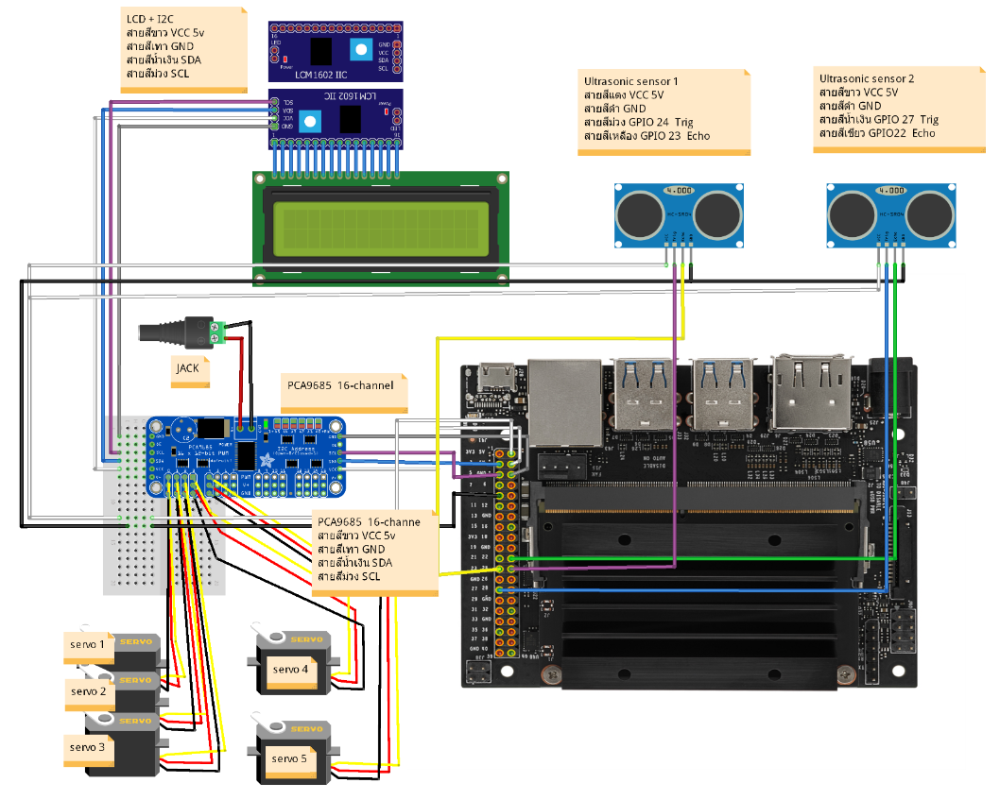
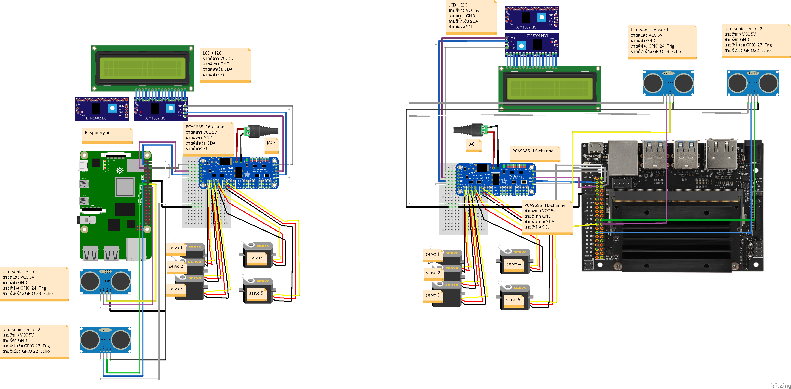

## This is project Arm Robot Automatic

ไลบรารี สำหรับ LCD
* Folder ชื่อ drivers 
* File ชื่อ lcdlib.py

ไลบรารี สำหรับ จุดใบหน้า
* Folder ชื่อ dlib
* File ชื่อ shape_predictor_68_face_landmarks.dat

ไลบรารี สำหรับ Servo motor
* Folder ชื่อ Adafruit_Python_PCA9685

## รูปวงจรของ Raspberry pi

## รูปวงจรของ  jetson nano

## ภาพรวม

